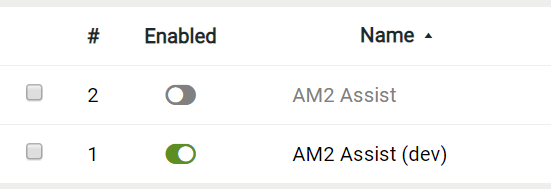
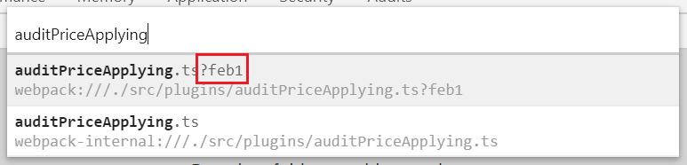

## Prerequisites

Node.js: <https://nodejs.org/en/download/>

## Getting started

```text
npm install
```

## How to...
### Enable dev mode
1. Under project root, run:
    ```text
    npm run start
    ```
    This will create a local dev server at <http://localhost:8080> that will always serve the newest bundle, including changes you've made.

2. Install dev bootstrapper at <http://localhost:8080/AM2_Assist.dev.user.js>. Make sure **only** 'AM2 Assist (dev)' is enabled in Tampermonkey dashboard:

    

3. From here, you'll be able to make code change in this project, and see it in action on AM2 website.

4. Once dev server is shut down, you'll need to re-enable 'AM2 Assist' from Tampermonkey dashboard.

### Build userscript bundle
Under project root, `npm run build` will produce the user bundle `AM2_Assist.user.js` in `dist` folder. It's in ship flavor by default.

If you want a human-readable version, run `npm run build:dev`.

### Add a plugin
1. Create a properly named `.ts` file under `src/plugins` folder.

2. In this file, export a `Plugin` object that contains `name`, `urlPatterns`, and `action`. See [src/plugins/auditPriceApplying.ts](../src/plugins/auditPriceApplying.ts) as an example.

3. Add your plugin in `src/plugins/index.ts` to register it.

### Debug a plugin
1. On any AM2 webpage, press `F12` to open Chrome DevTools panel.

2. Press `Ctrl/Cmd` + `P` and start typing any file name from this project.

3. In the drop down list, choose the file **with a hash** at the end.

    
4. Now you can debug (breakpoint, step, watch) the plugin.
